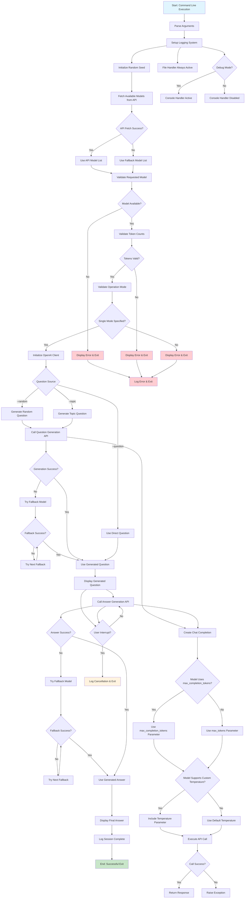

# askgpt Workflow Flowchart

This flowchart visualizes the complete execution flow of the askgpt application, showing all decision points, error handling, and API interactions.

```mermaid
flowchart TD
    A[Start: Command Line Execution] --> B[Parse Arguments]
    B --> C[Setup Logging System]
    C --> D[Initialize Random Seed]
    D --> E[Fetch Available Models from API]
    
    E --> F{API Fetch Success?}
    F -->|Yes| G[Use API Model List]
    F -->|No| H[Use Fallback Model List]
    
    G --> I[Validate Requested Model]
    H --> I
    
    I --> J{Model Available?}
    J -->|No| K[Display Error & Exit]
    J -->|Yes| L[Validate Token Counts]
    
    L --> M{Tokens Valid?}
    M -->|No| N[Display Error & Exit]
    M -->|Yes| O[Validate Operation Mode]
    
    O --> P{Single Mode Specified?}
    P -->|No| Q[Display Error & Exit]
    P -->|Yes| R[Initialize OpenAI Client]
    
    R --> S{Question Source}
    
    S -->|--question| T[Use Direct Question]
    S -->|--random| U[Generate Random Question]
    S -->|--topic| V[Generate Topic Question]
    
    U --> W[Call Question Generation API]
    V --> W
    
    W --> X{Generation Success?}
    X -->|No| Y[Try Fallback Model]
    Y --> Z{Fallback Success?}
    Z -->|No| AA[Try Next Fallback]
    Z -->|Yes| BB[Use Generated Question]
    AA --> Z
    X -->|Yes| BB
    
    T --> BB
    BB --> CC[Display Generated Question]
    CC --> DD[Call Answer Generation API]
    
    DD --> EE{Answer Success?}
    EE -->|No| FF[Try Fallback Model]
    FF --> GG{Fallback Success?}
    GG -->|No| HH[Try Next Fallback]
    GG -->|Yes| II[Use Generated Answer]
    HH --> GG
    EE -->|Yes| II
    
    II --> JJ[Display Final Answer]
    JJ --> KK[Log Session Complete]
    KK --> LL[End: Successful Exit]
    
    %% Error Paths
    K --> MM[Log Error & Exit]
    N --> MM
    Q --> MM
    
    %% Interrupt Handling
    CC --> NN{User Interrupt?}
    DD --> NN
    NN -->|Yes| OO[Log Cancellation & Exit]
    NN -->|No| DD
    
    %% API Call Details
    W --> PP[Create Chat Completion]
    DD --> PP
    PP --> QQ{Model Uses max_completion_tokens?}
    QQ -->|Yes| RR[Use max_completion_tokens Parameter]
    QQ -->|No| SS[Use max_tokens Parameter]
    
    RR --> TT{Model Supports Custom Temperature?}
    SS --> TT
    TT -->|Yes| UU[Include Temperature Parameter]
    TT -->|No| VV[Use Default Temperature]
    
    UU --> WW[Execute API Call]
    VV --> WW
    WW --> XX{Call Success?}
    XX -->|Yes| YY[Return Response]
    XX -->|No| ZZ[Raise Exception]
    
    %% Logging Throughout
    C --> AAA[File Handler Always Active]
    C --> BBB{Debug Mode?}
    BBB -->|Yes| CCC[Console Handler Active]
    BBB -->|No| DDD[Console Handler Disabled]
    
    style A fill:#e1f5fe
    style LL fill:#c8e6c9
    style MM fill:#ffcdd2
    style OO fill:#fff3e0
    style K fill:#ffcdd2
    style N fill:#ffcdd2
    style Q fill:#ffcdd2
```
